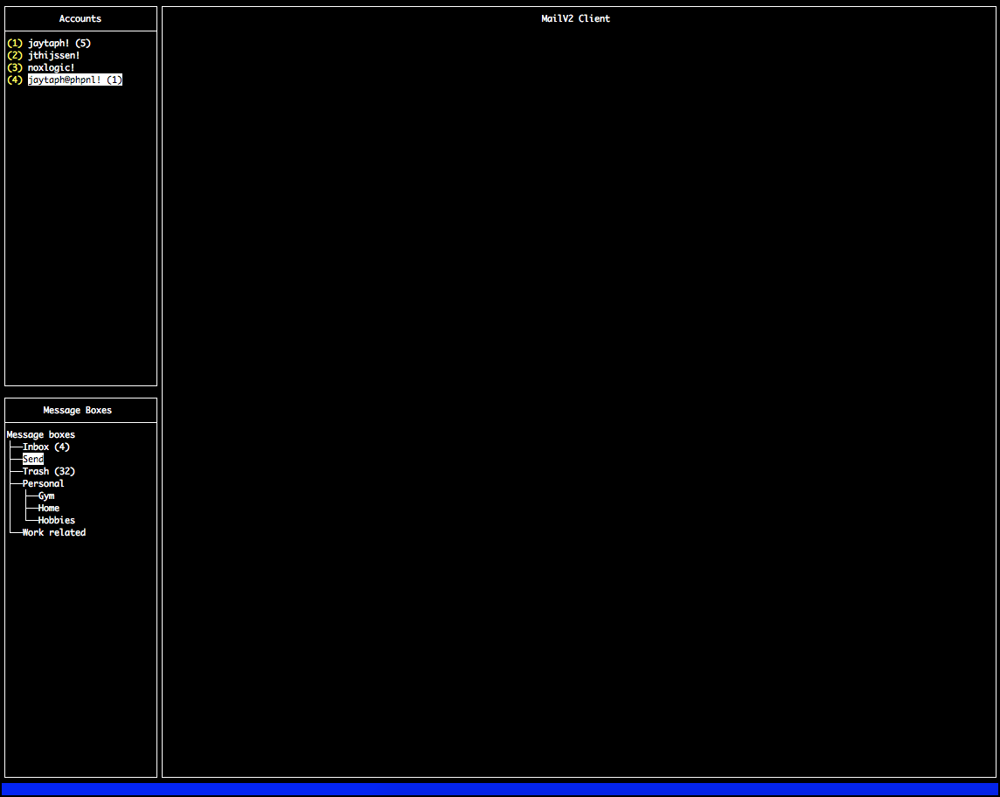

# What if
we could redesign email without any need for backward compatiblity. What would it look like? Probably not like this, but at least its an attempt.
We're trying to figure out how to make email a secure (end-to-end encrypted) system that will both combat spam and brings you back in charge of 
your mail again. This means you and only you can signup for mailing-lists, you can unsubscribe whenever you like (cannot be ignored by the 
mailinglist owners). It also means a vast reduction of spam emails, as sending spam is expensive for spammers.

It even provides additional functionality:

  - less spam (hopefully, spam free)
  - no more email address leaks
  - host your messages wherever you like
  - move your messages to another mailserver without loosing your mail address 
  - easily detect mailing-lists for your favourite companies and organisations
  - don't get tracked (unless you want to)

# How do we want to achieve all this

### less spam (hopefully, spam free)
There are multiple ways we try to combat spam:

  - we verify that the email came from the original sender and is not in any way tampered.
  - sending out emails costs effort, making it less economic for spamlists as sending out thousands (even millions) of
    messages comes too costly. When botnets (computers taken over by unknowning users that sends out spam) are used, 
    it will trigger enough workload to become either noticable for botnet victims, or not economic viable to use these 
    kind of systems.
  - when sending ligimate emails, we allow users to enroll in mailing-lists. This gives the mailing-list owner a personal
    key that will allow you to send mail to users for this specific list. Even if this key gets public through hacks 
    and leaks, no other organisation or user cannot do anything with this information, as this key is not valid anymore.
  - Not signed up for this list? Since signing up becomes an action from the recipient and not from the sender, this 
    makes the recipient in charge. Don't want to receive any more emails? Just revoke your key for that mailinglist and 
    they are not able to send you mail. 
  - Selling compiled email lists is not viable anymore. Personal keys are only valid for that specific organisation 
    and not for others, making large email lists pointless. 

### no more email address leaks
Obviously, we cannot prevent that your email address will be leaked. You must make your address public to at least 
others in order to receive email and we cannot guarantee that those users will take care of your address.

However, when your email is leaked, it will not be feasible for spam lists to send you email (see: the less spam 
bullit above). Ligitimate mailing lists can only mail you with a personal key that only works for that specific 
mailing list.

### host your messages wherever you like
Setting up a mail server is easy and by default secure out of the box. Just point your mail address to your new server 
and you are good to go! 

### move your messages to another mailserver without loosing your mail address
Don't like company X anymore, or getting to pricy? Or maybe you just want to move hosting provider, just because. Take 
your email address with you.  

 
### easily detect mailing-lists for your favourite companies and organisations
Find information about users and organisations by quering their mailserver. This way you can easily figure out if they 
have mailinglists and give you to opportunity to join them.

Want a secure and private mailinglist? That's no problem too! You can send out invitations to others and don't allow 
public registration.

### don't get tracked (unless you want to)
Everything inside the message is encrypted and can only be read by the recipient of the email. This means that no 
server or agency that captures the traffic can view the contents and even the meta-data of your messages. The only piece
of information available is the SHA256 of the sender and recipient. 

# Usage

* Think of a FQDN to host your message server. It doesn't have to exist for local development. For instance `mail.test.v2`

* Create a server certificate and key file. 

    openssl req -x509 -newkey rsa:4096 -keyout server-passphrase.key -out server.crt -days 3650

    Most important part is that you set your CN (common name)to the FQDN chosen above. You need to add a passphrase to the key.
 
* Remove the passphrase from the key:
 
    openssl rsa -in server-passphrase.key -out server.key

* Or, if you like, you can always use LetsEncrypt to fetch your own certificate (with the help of certbot). Make sure you 
  name your certificate `server.crt` and key `server.key`.

* Build the components:

    ./build.sh
    
    
# Mail server

* You'll need redis. Run either locally or via a container. Make sure you set the host info in the configuration file `./config.yml`

* Run the mail-server:

    ./release/mailv2-server -config ./config.yml

    This will run a mailserver on localhost port 2424 over a TLS connection.
    
    Configuration for the server can be found in `./server-config.example.yml`

## Paths and files

Public keys that are pushed to the mailserver are stored in the `.keydb` directory.
Mail is stored in the `.maildb` directory.

# Mail client

Some kind of client is underway. It uses rivo/tview as UI framework.

 

